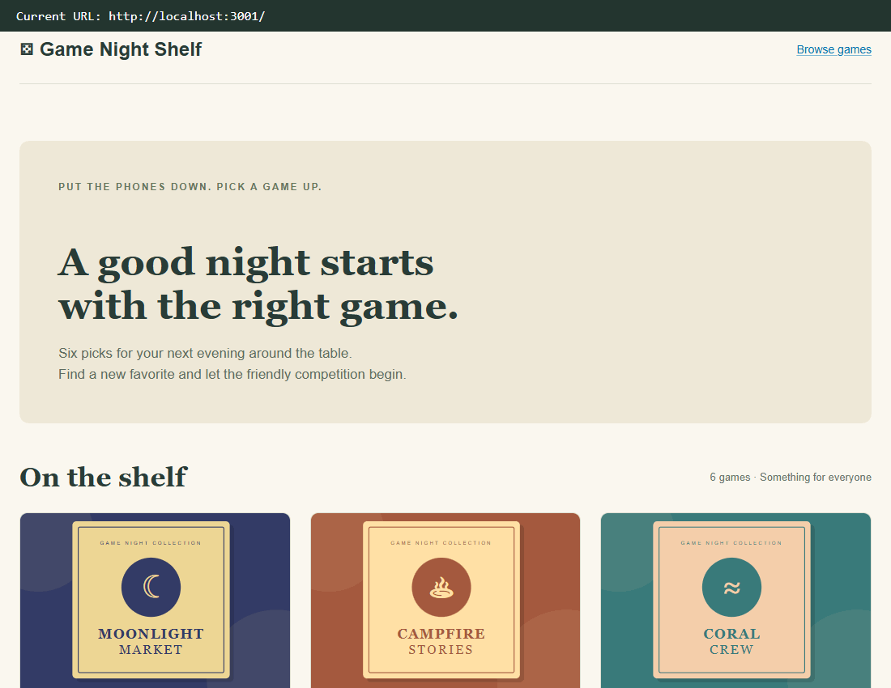

# WEB103 Project 1 - *Game Night Shelf*

Submitted by: **Brandon Delgado**

About this web app: **Game Night Shelf is a listicle of six fictional board games. Browse illustrated cards and open each game's detail page to view its category, player count, play time, price, description, cover image, submitter, and ID.**

Time spent: **4** hours

## Required Features

The following **required** functionality is completed:

<!-- Make sure to check off completed functionality below -->

- [x] **The web app uses only HTML, CSS, and JavaScript without a frontend framework**
- [x] **The web app displays a title**
- [x] **The web app displays at least five unique list items, each with at least three displayed attributes (such as title, text, and image)**
- [x] **The user can click on each item in the list to see a detailed view of it, including all database fields**
  - [x] **Each detail view should be a unique endpoint, such as as `localhost:3000/bosses/crystalguardian` and `localhost:3000/mantislords`**
  - [x] *Note: When showing this feature in the video walkthrough, please show the unique URL for each detailed view. We will not be able to give points if we cannot see the implementation*
- [x] **The web app serves an appropriate 404 page when no matching route is defined**
- [x] **The web app is styled using Picocss**

The following **optional** features are implemented:

- [x] The web app displays items in a unique format, such as cards rather than lists or animated list items

The following **additional** features are implemented:

- [x] Responsive layouts for desktop and mobile screens.
- [x] Loading, empty-list, and failed-request messages.
- [x] Local cover images and Pico CSS that do not require a CDN at runtime.

## Video Walkthrough

**Note: The walkthrough displays the current page URL in a recording-only caption for each of the six detail views.**

Here's a walkthrough of implemented required features:

GIF created with **Playwright screenshots and gifenc**. URL captions are read from the browser's current location and added only during recording; they are not part of the app.

## Notes

The project follows the UnEarthed lab's client/server structure, Express router, JavaScript data array, `fetch()`, and DOM methods such as `createElement()`, `textContent`, and `appendChild()`. The detail page fetches the game array and uses `find()` to select the requested game.

One setup challenge was making styles and scripts load correctly on both the home page and nested detail URLs. Shared assets use paths starting with `/`, and Vite builds the client into `server/public` so Express can serve them. Unknown game IDs and unmatched routes return HTTP 404.

All games and prices are fictional. Pico CSS retains its [MIT license](client/public/PICO-LICENSE.md). See [SETUP.md](SETUP.md) for installation instructions, routes, and the file structure. Add your actual time spent above before submitting.

## License

Copyright 2026 Brandon Delgado

Licensed under the Apache License, Version 2.0 (the "License"); you may not use this file except in compliance with the License. You may obtain a copy of the License at

> http://www.apache.org/licenses/LICENSE-2.0

Unless required by applicable law or agreed to in writing, software distributed under the License is distributed on an "AS IS" BASIS, WITHOUT WARRANTIES OR CONDITIONS OF ANY KIND, either express or implied. See the License for the specific language governing permissions and limitations under the License.
