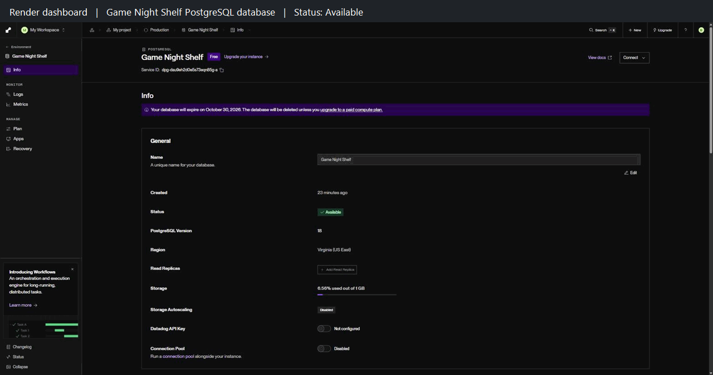

# WEB103 Project 2 - *Game Night Shelf*

Submitted by: **Brandon Delgado**

About this web app: **Game Night Shelf is a listicle of six fictional board games, now served from a PostgreSQL database hosted on Render. Browse illustrated cards and open each game's detail page to view its category, player count, play time, price, description, cover image, submitter, and ID.**

Time spent: **X** hours

## Required Features

The following **required** functionality is completed:

<!-- Make sure to check off completed functionality below -->
- [x] **The web app uses only HTML, CSS, and JavaScript without a frontend framework**
- [x] **The web app is connected to a PostgreSQL database, with an appropriately structured database table for the list items**
  - [x] **NOTE: Your walkthrough added to the README must include a view of your Render dashboard demonstrating that your Postgres database is available**
  - [x]  **NOTE: Your walkthrough added to the README must include a demonstration of your table contents. Use the psql command 'SELECT * FROM tablename;' to display your table contents.**

The following **optional** features are implemented:

- [ ] The user can search for items by a specific attribute

The following **additional** features are implemented:

- [x] Unknown game IDs are checked against the database and return a custom 404 page.
- [x] The seed script inserts games in order, so each game keeps the same ID and detail URL every time the database is reset.
- [x] Responsive layouts for desktop and mobile screens.
- [x] Loading, empty-list, and failed-request messages.

## Video Walkthrough

Here's a walkthrough of implemented required features:

GIF created with **Chrome screenshots, a psql console capture, and gifenc**. The caption bar above each frame shows the page URL or what is on screen; it is added only for the recording and is not part of the app.

## Notes

The project follows the UnEarthed lab's database setup. `server/config/database.js` creates a `pg` connection pool from the environment variables in `server/.env`, and `server/config/reset.js` recreates the `games` table and seeds it with the six games in `server/data/games.js`. `GET /games` now uses a controller that queries the table with `SELECT * FROM games ORDER BY id ASC`.

One challenge was that PostgreSQL stores unquoted column names in lowercase, so `playTime` and `submittedBy` come back from the database as `playtime` and `submittedby`. The client scripts were updated to read those property names.

All games and prices are fictional. Pico CSS retains its [MIT license](client/public/PICO-LICENSE.md). See [SETUP.md](SETUP.md) for installation instructions, routes, and the file structure.

## License

Copyright 2026 Brandon Delgado

Licensed under the Apache License, Version 2.0 (the "License"); you may not use this file except in compliance with the License. You may obtain a copy of the License at

> http://www.apache.org/licenses/LICENSE-2.0

Unless required by applicable law or agreed to in writing, software distributed under the License is distributed on an "AS IS" BASIS, WITHOUT WARRANTIES OR CONDITIONS OF ANY KIND, either express or implied. See the License for the specific language governing permissions and limitations under the License.
